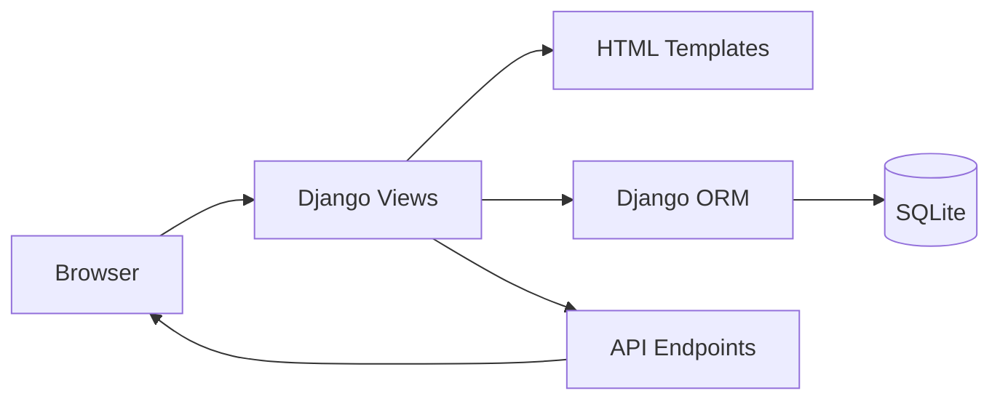

# TrainDjango — Training Management Web Application (Django)

**TrainDjango** is a Django-based web application designed to manage training programs, users, and related data through a clean MVC architecture and REST-style endpoints.

The project demonstrates **classic backend engineering fundamentals**: Django ORM modeling, server-side rendering, form handling, and API-style views — all structured in a clear, production-oriented layout.

---

## What This Project Is About

TrainDjango is built as a **domain-driven Django application**.

It shows how to:
- model application domain using Django ORM
- separate core project configuration from business logic
- implement CRUD operations via views and forms
- structure Django apps for scalability
- combine server-rendered pages with API-style endpoints

The same architecture can be applied to:
- internal management systems
- admin dashboards
- educational platforms
- CRUD-heavy business applications

---

## Key Features

- Training entity management
- User interaction via Django views and forms
- Server-rendered HTML templates
- Modular Django app structure
- API-style endpoints for data access
- SQLite database for local development

---

## High-Level Architecture



**Design principle:**  
Clear separation between configuration, domain logic, and presentation.

---

## Backend Overview

The backend follows standard Django best practices.

### Core Responsibilities
- HTTP request handling
- Business logic execution
- Database persistence
- Template rendering
- API responses

### Django Apps Structure

```
DjangoPr/
  settings.py        Project configuration
  urls.py            Global routing
base/
  models.py          Domain models
  views.py           View logic
  forms.py           Form definitions
  urls.py            App routing
  templates/         HTML templates
```

---

## Technology Stack

### Backend
- **Python**
- **Django**
- **Django ORM**
- **SQLite** (development database)

### Frontend
- **HTML / CSS**
- **Django Templates**

### Tooling
- **manage.py**
- **Django migrations**
- **Virtual environment support**

---

## Running the Project Locally

### 1. Create virtual environment
```bash
python -m venv venv
source venv/bin/activate   # Linux / macOS
venv\Scripts\activate    # Windows
```

### 2. Install dependencies
```bash
pip install django
```

### 3. Apply migrations
```bash
python manage.py migrate
```

### 4. Run development server
```bash
python manage.py runserver
```

Open in browser:
```
http://127.0.0.1:8000/
```

---

## Design Principles

- Explicit data modeling
- Server-side rendering first
- Clear separation of concerns
- Predictable request lifecycle
- Simplicity over over-engineering

---

## What This Project Demonstrates

- Django project structuring
- MVC / MVT architectural pattern
- CRUD application development
- ORM-based data access
- Backend-first thinking

---

## Final Notes

TrainDjango is intentionally focused on **core Django fundamentals**.

It serves as a solid reference project that demonstrates how to:
- design backend-centric web applications
- structure Django projects cleanly
- build maintainable CRUD systems ready for extension

